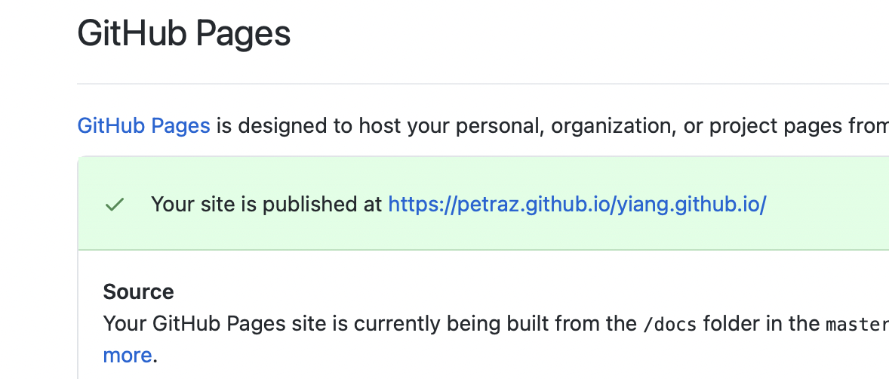

## Goal
I've been trying to use Hugo to build personal static site in last couple days and found though it's really convenient to write markdown as blogs once you get used to it, the setup of all components does take some time and efforts.

This tutorial is mainly to solve | ease this problem.

## Steps

1. Install hugo

    If you're a mac user, simply run `brew install hugo`, and you should be all set. If you don't have brew, you can go to `https://brew.sh` to install brew.

    For windows | linux user, you can follow the [official document](https://gohugo.io/getting-started/installing/) to install hugo.

2. Basic Understanding of hugo and setup

    Once you install hugo and ran `hugo help`, you should be able to see some available commands in terminal.

    Then you'll need to run `hugo new site (your site name here)` replace a prefered name in (), to create a template site. This folder would contain 
    
    - content --> where you put markdowns
    - themes --> where you put (others' theme in)
        
        you can browse [here](https://themes.gohugo.io) to find your favourite theme

    `cd {your site name}`

    `cd themes`

    A theme is usually stored in a github repo.

    In your theme folder, run `git submodule add {the github repo you picked}`

    This step add your prefered theme into your template folder.

    To enable it, you need to go to your config.toml and add `theme = your theme name `(the folder name you added into themes folder). This allows hugo be able to find which theme to use. You can potentially add multiple themes in your themes folder and pick one to use!

3. Run the server and build your site
    
    If everything is set up correctly, now go back to your template folder

    run `hugo server`, which pops up something like 
    `Web Server is available at http://localhost:1313/ (bind address 127.0.0.1)`
    click the link, you shall be able to see the barebone template of your site!

    Next question is how should you config your site and add markdown(blogs),
    it varies a bit per theme you use, but the general idea is 

    Copy the example config the author provided, normally it sits in readme or exampleSite folder on github. There're detailed explanation of each field and you can also play with it by changing values and see your localhost page repsonses.

    Once you got that basic config done, you then can create markdown files in the content folder via command `hugo new {your_file_name}`.
    
    Normally, your config.toml should contain the main menu of the entry page like 
    ```
    [[menu.main]]
        name = "Posts"
        url = "/posts"
        weight = 2
    ```
    this means you could put all your posts into `./content/posts`
    like `hugo new ./content/posts/first_post.md` and start your writing on yout markdown file.

    Harray! Now you know how to create markdowns that will show up in proper locations!

4. How to show it to the world

    Github now has a functionality called github Page, which allows to render these statict pages. What you need to do is create a repo that with xxx.github.io as name and in the settings enable github pages
    

    Now run `hugo` command in your template to generate a folder called public

    copy the content in this public files and push it to the github repo you created, and then github page will render all contents you want there!

    Your site is ready to show to the world!